# TryHackMe: Windows Fundamentals 1 — Writeup

**Room:** [Windows Fundamentals 1](https://tryhackme.com/room/windowsfundamentals1) · Cyber Security 101 → Windows and AD Fundamentals
**Difficulty:** Info / Beginner

> ⚠️ **Note:** The account description field (functioning as a stored credential/password hint) has been redacted from the screenshots below. All techniques, tools, and navigation steps remain fully visible — only the actual secret value is blurred, so this stays a walkthrough rather than a spoonfeed.

## Overview

Part 1 of the Windows Fundamentals module — covering the Windows desktop, the taskbar, the NTFS file system, system variables, User Account Control (UAC), local user/group management, and the Control Panel.

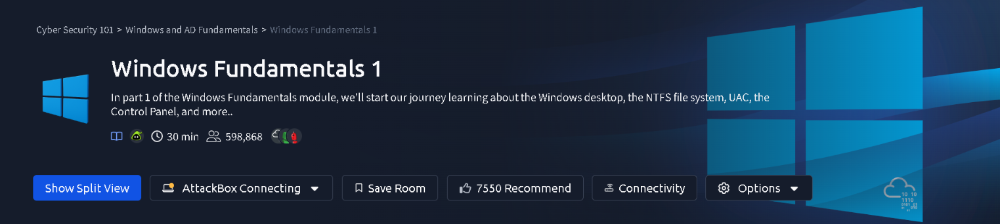

---

## Task — The Windows Desktop & Taskbar

Explored the taskbar's customization options — settings control what's shown in the Search box, Task View button, and the Notification Area.

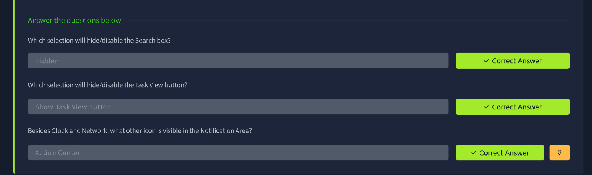

**Answers:**
| Question | Answer |
|---|---|
| Which selection will hide/disable the Search box? | `Hidden` |
| Which selection will hide/disable the Task View button? | `Show Task View button` |
| Besides Clock and Network, what other icon is visible in the Notification Area? | `Action Center` |

---

## Task — The NTFS File System

**Answer:**
| Question | Answer |
|---|---|
| What is the meaning of NTFS? | `New Technology File System` |

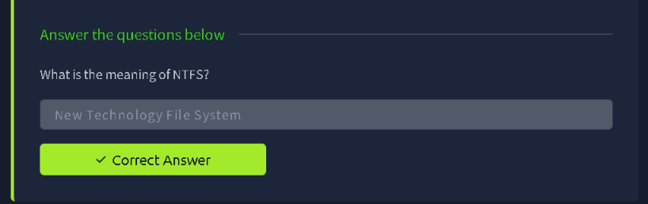

---

## Task — System Variables

**Answer:**
| Question | Answer |
|---|---|
| What is the system variable for the Windows folder? | `%windir%` |

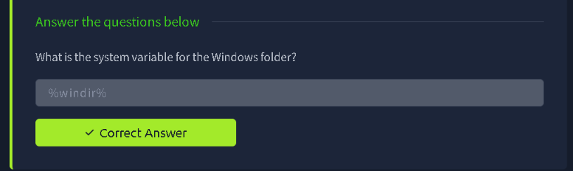

---

## Task — User Accounts & Local Groups

Using **Local Users and Groups** (`lusrmgr.msc`) on the target Windows machine to enumerate the other local account present on the box.

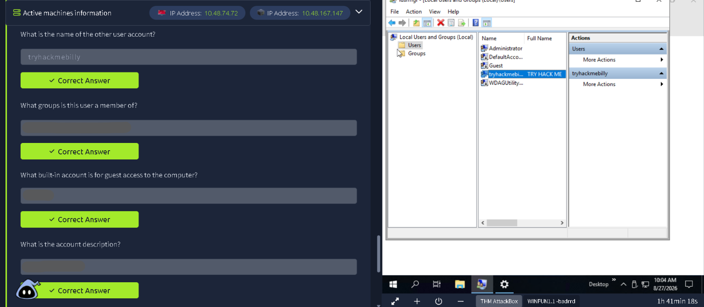

### Checking group membership

Opening the account's **Properties → Member Of** tab revealed which groups it belongs to.

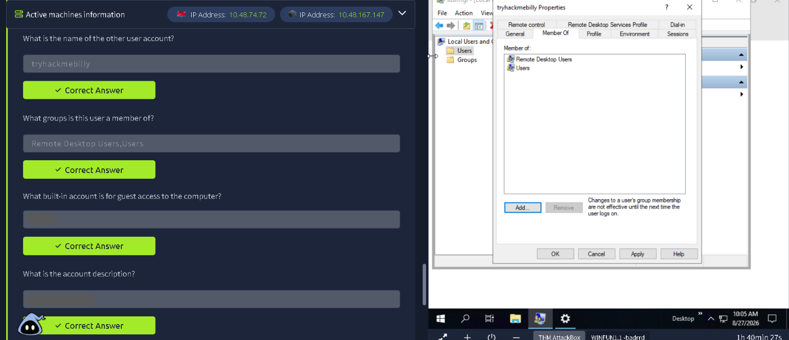

### Reviewing the account description

The **General** tab of the account's properties held its full name and description field.

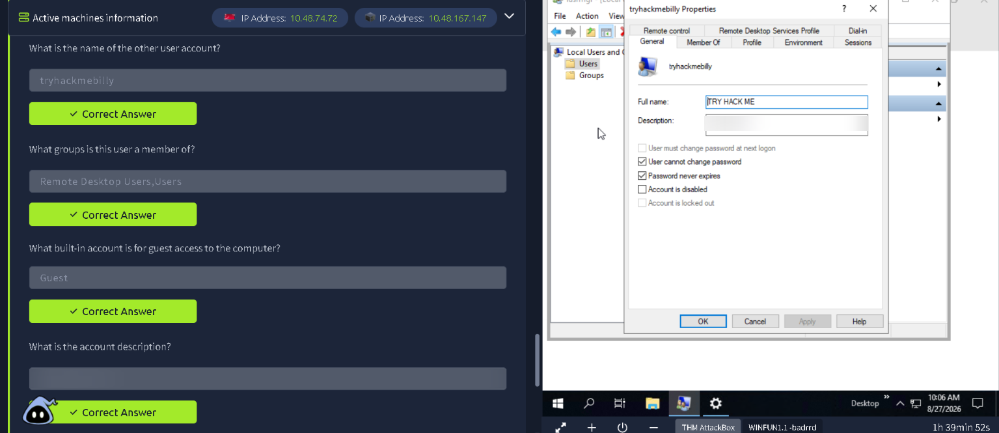

**Answers:**
| Question | Answer |
|---|---|
| What is the name of the other user account? | `tryhackmebilly` |
| What groups is this user a member of? | `Remote Desktop Users, Users` |
| What built-in account is for guest access to the computer? | `Guest` |
| What is the account description? | *(redacted)* |

---

## Task — User Account Control (UAC)

**Answer:**
| Question | Answer |
|---|---|
| What does UAC mean? | `User Account Control` |

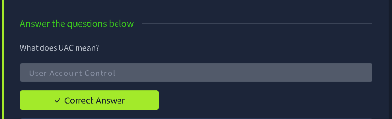

---

## Task — The Control Panel

Switching the Control Panel view to **Small icons** reorders all applets alphabetically — the last entry in that list is Windows Defender Firewall.

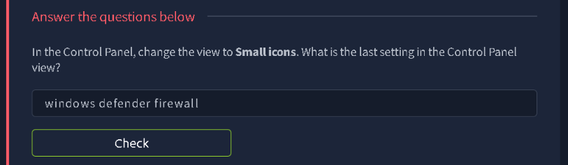

**Answer:**
| Question | Answer |
|---|---|
| In the Control Panel, change the view to Small icons. What is the last setting in the Control Panel view? | `Windows Defender Firewall` |

---

## Task — Task Manager

**Answer:**
| Question | Answer |
|---|---|
| What is the keyboard shortcut to open Task Manager? | `Ctrl+Shift+Esc` |

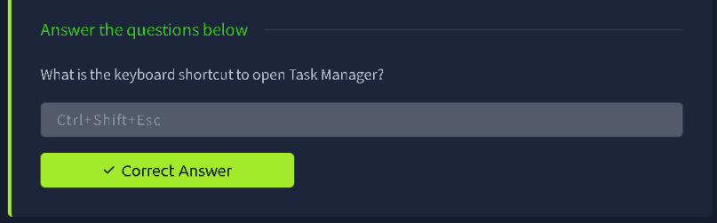

---

## Task — Windows Editions & Encryption

**Answer:**
| Question | Answer |
|---|---|
| What encryption can you enable on Pro that you can't enable in Home? | `BitLocker` |

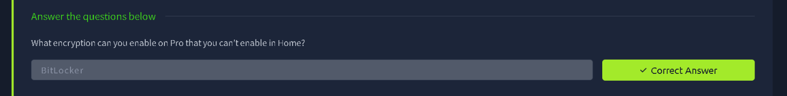

---

## Summary

This room built foundational Windows admin knowledge: navigating the desktop/taskbar, understanding NTFS and system variables, managing local users and groups via `lusrmgr.msc`, UAC, the Control Panel, Task Manager, and the encryption features that differ between Windows editions.

**Key takeaways:**
- `lusrmgr.msc` (Local Users and Groups) is the go-to GUI tool for quickly auditing local accounts, their group memberships, and any notes left in the account description field — useful during both legitimate admin work and initial recon on a Windows host.
- Account description fields are sometimes (mis)used to store hints or even plaintext credentials — worth checking during any local enumeration.
- BitLocker being Pro/Enterprise-only is a good practical reminder that full-disk encryption isn't guaranteed on every Windows install — worth confirming before assuming a seized/lost device is protected.
